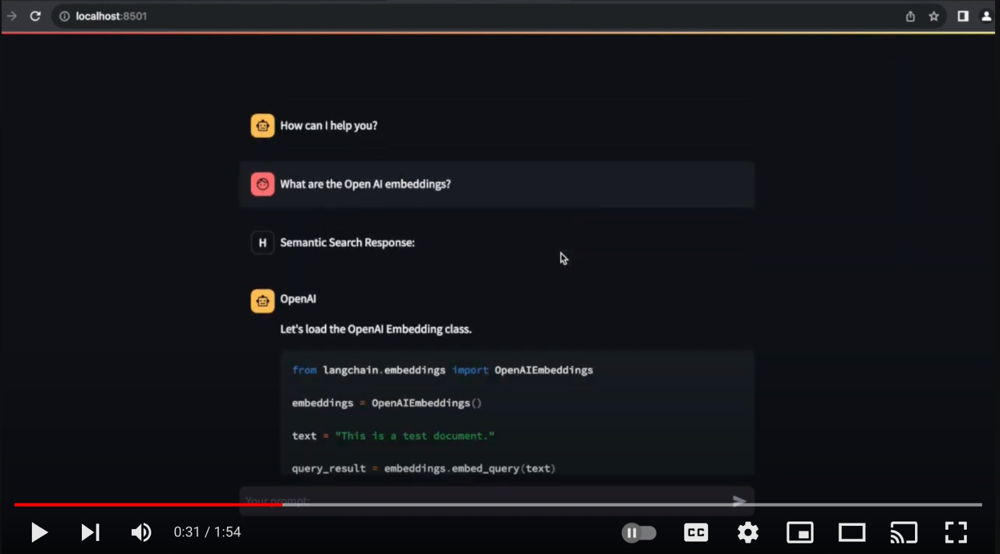

# Supercharge Your Wisdom

This project contains a Streamlit Chat interface and a Luigi ETL Pipeline that processes and stores documents into a Weaviate Vectorstore instance.

The ETL pipeline performs several tasks, including: converting Jupyter notebooks and Python scripts to Markdown format, cleaning the code blocks in the Markdown files, removing unnecessary files and directories, and uploading the processed data to a Weaviate instance.

- https://www.youtube.com/watch?v=R8swIcq549I

[](https://www.youtube.com/watch?v=R8swIcq549I)

- [Supercharge Your Wisdom](#supercharge-your-wisdom)
  - [Installation](#installation)
  - [Environment Variables (.env)](#environment-variables-env)
  - [Running the ETL Pipeline](#running-the-etl-pipeline)
  - [Luigi Tasks (ETL Orchestrator)](#luigi-tasks-etl-orchestrator)
  - [Running the Chat Interface](#running-the-chat-interface)
  - [Weaviate Configuration](#weaviate-configuration)
  - [Contributing](#contributing)
  - [License](#license)
  - [Happy Hacking!](#happy-hacking)

## Installation

Before you start, ensure that you have Python 3.11 or later installed.

1. Clone the repository:
```
git clone https://github.com/josoroma/etl-pipeline-for-langchain-docs
cd etl-pipeline-for-langchain-docs
```

2. Set up the project by installing the dependencies using the `setup` directive. This creates a virtual environment and installs the necessary packages specified in the `pyproject.toml` file.
```bash
make setup
make add
make run-etl-daemon
```

## Environment Variables (.env)

Before running the application, set the following environment variables:

- [Your OpenAI API key.](https://platform.openai.com/account/api-keys)
- [The URL of your Weaviate instance.](https://console.weaviate.cloud/)
- [The API key for your Weaviate instance.](https://console.weaviate.cloud/)

```
OPENAI_API_KEY=sk-...
WEAVIATE_HOST=https://documents.weaviate.network
WEAVIATE_AUTH_API_KEY=mb3q...rt85
```

## Running the ETL Pipeline

You can start the ETL pipeline by running the `run-etl-orchestrator` directive. This command starts the Luigi pipeline with the orchestrator task.
```bash
cd etl

poetry run python -m luigi --module orchestrator Orchestrator
```

To open the Luigi visualizer to monitor the progress of the ETL pipeline, you can use the `run-etl-visualizer` directive. This command opens the Luigi visualizer interface in a web browser at `http://localhost:8082`.
```bash
make run-etl-visualizer
```

## Luigi Tasks (ETL Orchestrator)

- https://luigi.readthedocs.io/en/stable/tasks.html

- https://luigi.readthedocs.io/en/stable/execution_model.html

The ETL pipeline consists of several Luigi tasks:

- `BuildDataLake`: Downloads data from a repository and builds a data lake.
- `ConvertIPYNBtoMyst`: Converts Jupyter notebooks to MyST format.
- `ConvertPytoMd`: Converts Python files to Markdown format.
- `DeleteNonMdFiles`: Deletes files that are not in Markdown format.
- `RemoveEmptyDirectories`: Removes empty directories.
- `CleanupCode`: Cleans up the code in the Markdown files.
- `RemoveJupyterText`: Removes any Jupyter-specific text from the Markdown files.
- `Upsert`: Uploads the processed data to a Weaviate Vectorstore instance.

These tasks are orchestrated by the `OrchestratorTask` in the `orchestrator.py` script.

## Running the Chat Interface

You can run the chat interface using the `run-chat` directive. This command starts the Streamlit application with the `chat.py` script.
```bash
make run-chat
```

References:

- https://blog.streamlit.io/beginners-guide-to-openai-api/

- https://docs.streamlit.io/library/cheatsheet

- https://docs.streamlit.io/knowledge-base/tutorials/build-conversational-apps

- https://github.com/langchain-ai/streamlit-agent

- https://blog.streamlit.io/langchain-streamlit/

- https://python.langchain.com/docs/integrations/callbacks/streamlit

## Weaviate Configuration

The configuration for the Weaviate class and schema is defined in the `weaviate_config.py` script. The Weaviate class is named "Document", and it uses the "text2vec-openai" vectorizer and the "generative-openai" module with the "gpt-4" model. The class has a single property "content" of data type "text".

## Contributing

If you want to contribute to this project, please fork the repository and create a pull request, or open an issue for discussion.

## License

We welcome contributions to this project! If you have insights, feedback, or code changes you'd like to contribute, please don't hesitate to get involved.

This project is licensed under the terms of the MIT license:

- https://mit-license.org/

## Happy Hacking!
